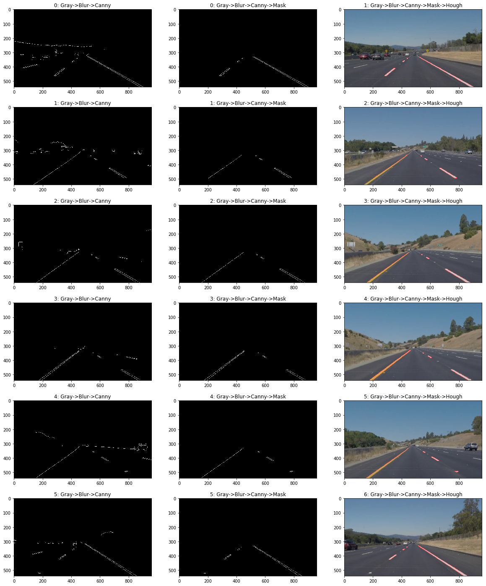

# **Finding Lane Lines on the Road** 

## Writeup Template

### You can use this file as a template for your writeup if you want to submit it as a markdown file. But feel free to use some other method and submit a pdf if you prefer.

---

**Finding Lane Lines on the Road**

The goals / steps of this project are the following:
* Make a pipeline that finds lane lines on the road
* Reflect on your work in a written report

---

### Reflection

### 1. Describe your pipeline. As part of the description, explain how you modified the draw_lines() function.

My pipeline consisted of 5 steps. First, I converted the images to grayscale, then I blurred the image using a  $7\times7$  Gaussian kernel, followed by Canny edge detection with ` low_threshold=70, high_threshold=250`. Then an appropriate mask polygon is applied.  Finally I applied Hough transform to obtain the lines with the parameters `rho=1, theta=np.pi/180, threshold=5, min_line_len=3, max_line_gap=3`. The figure below shows the intermediate outputs of the steps as illustrated by their titles, applied to all images.

In order to draw a single line on the left and right lanes, I modified the `draw_lines()` function. First, calculate the slope $m=\frac{y_2 - y_1}{x_2 - x_1}$. If $m\ge 0$; the line should be classified to the right, otherwise classified to the left. However, in some frames, we get noisy data,  small short horizontal lines that shouldn't be in included. One approach is to set a threshold, say $0.3$, such that a line is categorized to the right if $m \ge 0.3$ , and to the left if $m<-0.3$. (An alternative approach is to increase Hough `minLineLength`, but this may exclude short lines on the horizon). Still, some noisy  lines  with positive slope appears on the left direction. To solve this issue, I use a simple heuristic: right lines should appear on the right half of the image and left lines on the left of the screen. Thus, to classify a right lines, the following condition is used:

`slope > slope_threshold and x1 >= img.shape[1]/2 and x2 >= img.shape[1]/2`

Once lines are classified correctly, I store their $x$ and $y$ coordinates in `right_x` and `right_y` (resp. `left_x` and `left_y`). Then I fit a line $x=\frac{y-b}{b}$, through the coordinate using `np.polyfit(right_x,right_y,1)`(resp. `np.polyfit(right_x,right_y,1)`) function,  which returns parameters: $m$ and $b$ of the line.  To obtain a line from the bottom of the image, we substitute $y\leftarrow$ `img.shape[0]`. Similar trick is applied to extend the lines into the horizon.  

### 2. Identify potential shortcomings with your current pipeline

One potential shortcoming occurs when the lines are curved in a detour. I think fitting a straight may not fit all situations accurately. 

Another shortcoming could be with the mask, it is cropping relatively a large portion of the image (`[(130,imshape[0]),(450, 330), (550, 330), (imshape[1]-50,imshape[0])]`). If the camera lens is narrow, or if the car is driving a bit far from the lane, the whole left or right lines may be cropped by the mask.

### 3. Suggest possible improvements to your pipeline

A possible improvement would be to have adaptive mask based on control input and vehicle location with respect to the lane. For example, when steering left, the mask polygon should swerve left a bit to cover more region. If the vehicle is driving away from right lines, the mask should expand on the right side to cover that region.

Another potential improvement could be to incorporate images from previous time frames, instead of dealing with images independently. This may solve the challenge question.

